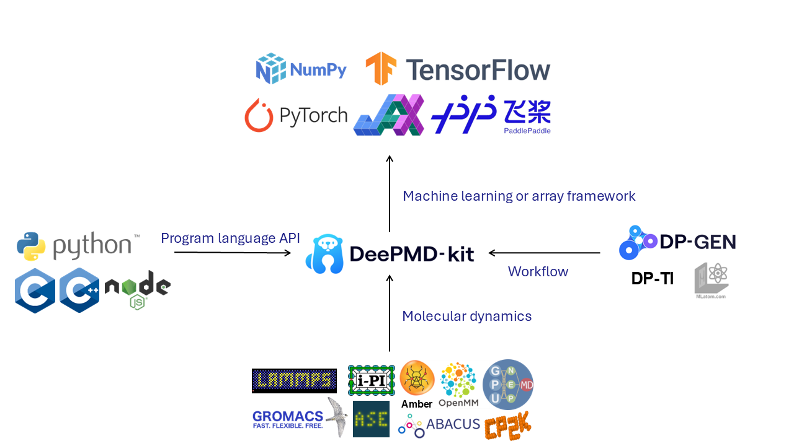

Established in February 2025 at the School of Artificial Intelligence and Data Science, University of Science and Technology of China (USTC), our group operates at the cutting-edge convergence of artificial intelligence and computational chemistry. We specialize in developing next-generation deep learning-based potential energy surface (PES) models to address fundamental challenges in molecular dynamics simulations.

Development of software for deep learning potentials, taken from [arXiv:2502.19161](https://doi.org/10.48550/arXiv.2502.19161)